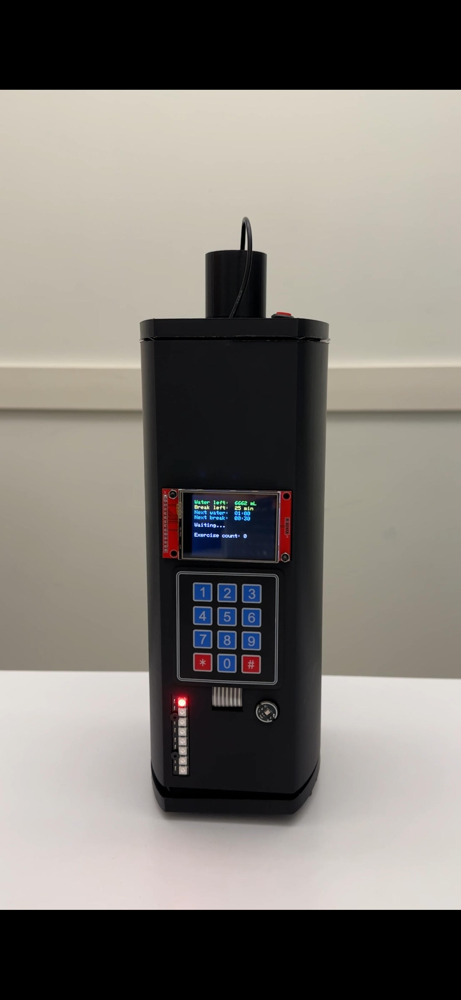
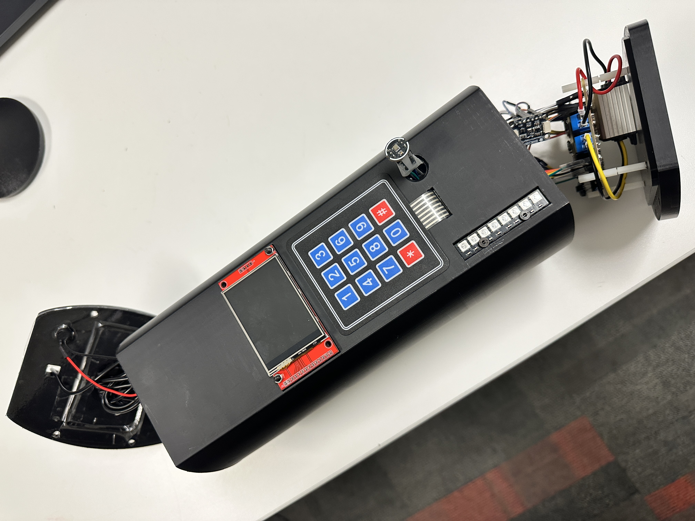
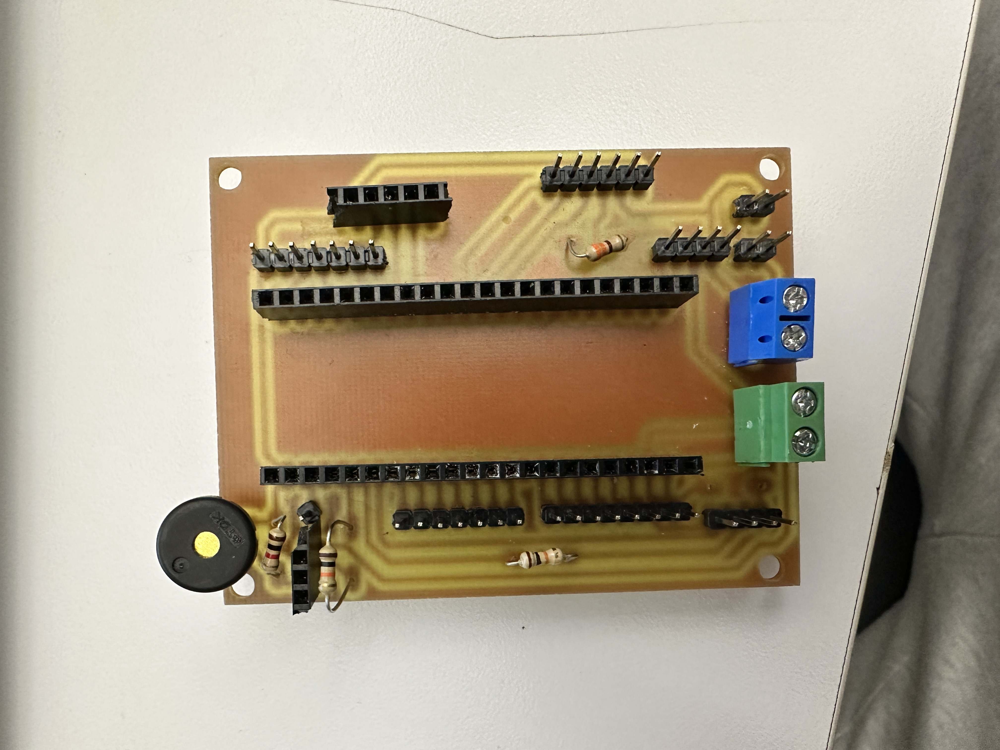
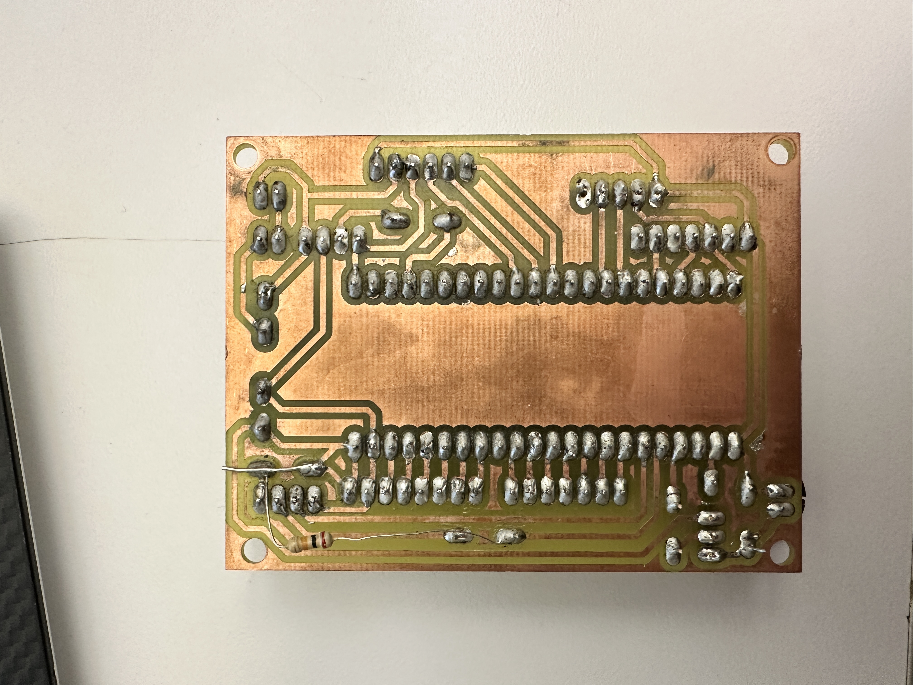
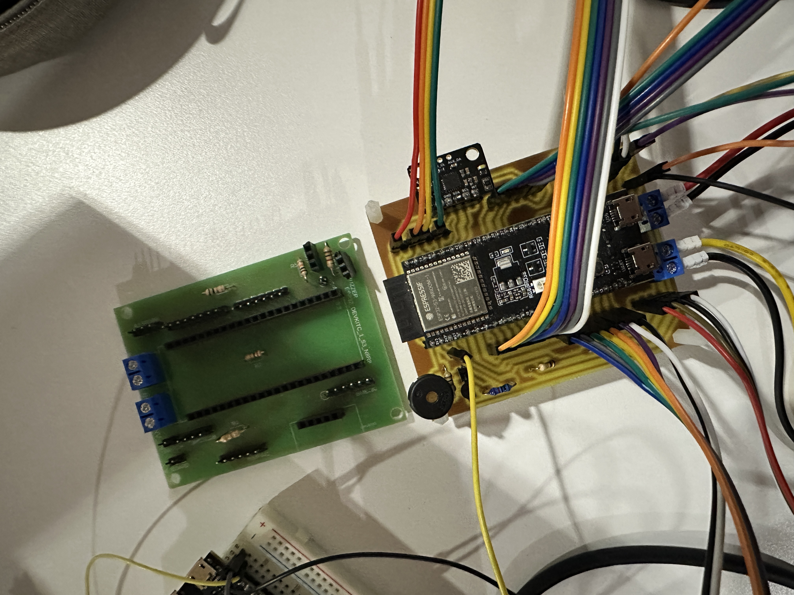
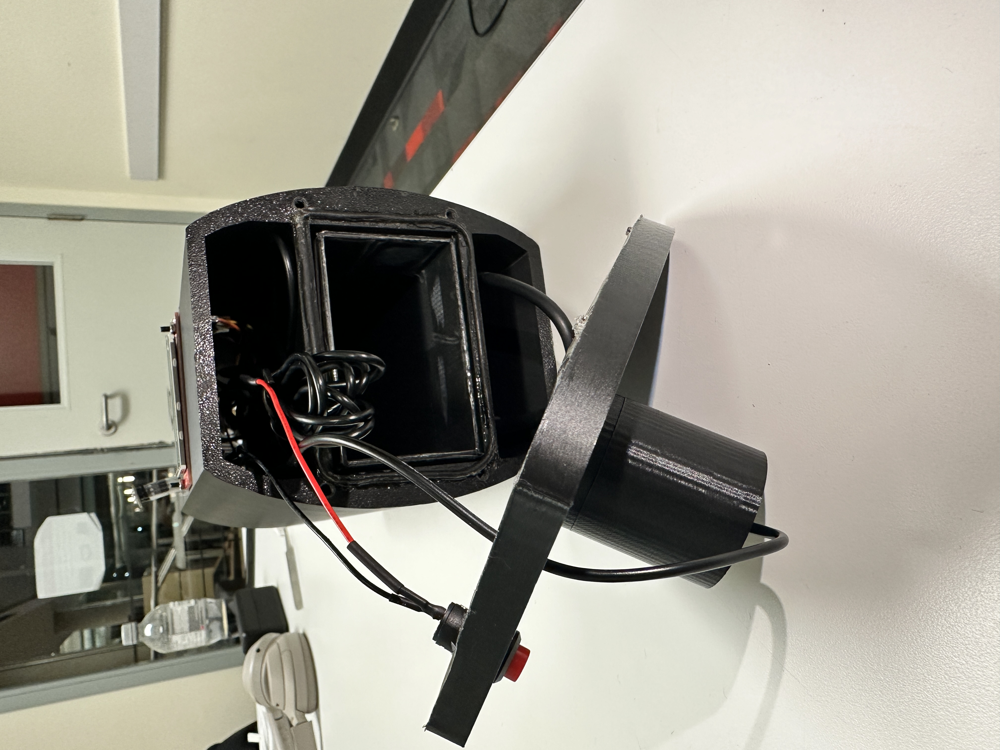
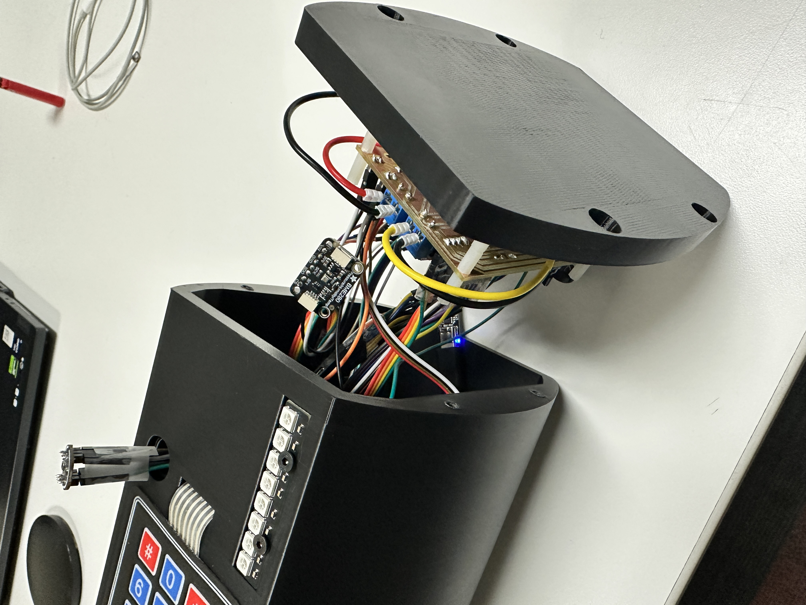

# Smart Hydration & Break Reminder Device

An IoT device built on an ESP32 microcontroller that tracks water intake and uses smart sensors to remind users to stay hydrated and take regular desk breaks. 

## 📸 Hardware Gallery

   
  <em>Fully Assembled Smart Hydration & Break Reminder Device Prototype</em>

---

### Internal Electronics & Fabrication
Below is the hardware configuration, custom PCB, and physical component layout inside the chassis:

| Chasis Base View | Custom PCB Tracking (Top) | Custom PCB Tracks (Bottom) |
|---|---|---|
|  |  |  |

| Sensor Module Routing | Top Base View | Bottom Base View |
|---|---|---|
|  |  |  |

---

## Abstract

Prolonged sedentary work and inadequate hydration are major contributing factors to chronic fatigue, musculoskeletal strain, and long-term metabolic health issues among students and office workers. To address these challenges, this project introduces the **Smart Hydration & Break Reminder Device** - an intelligent, hardware-integrated IoT solution designed to automate wellness coaching at the desk. By leveraging an ESP32-S3 microcontroller alongside an array of sensors, the device dynamically calculates personalized water intake targets based on user metrics and live ambient conditions (temperature and humidity). Additionally, it tracks sedentary periods using real-time motion vector analysis to adaptively schedule structural breaks. Featuring live local alerts via a TFT LCD shield and a NeoPixel layout, alongside continuous cloud synchronization to a remote Web UI dashboard, this device provides a seamless approach to fostering healthier physical habits in modern workspaces.

## System Functional Features & Specifications

The device operates via four major interdependent software subsystems that run locally on the ESP32-S3 microcontroller, synchronizing asynchronously with the Firebase backend.

### 1. Dynamic Hydration & Environmental Processing
The system updates local climate metrics and recalculates optimal hydration targets dynamically. Instead of relying on static intervals, the formula processes environmental fatigue vectors alongside user physical profiles.

* **Target Volume Base Calculation:**
  $$\text{Target Fluid (mL)} = (\text{Weight [kg]} \times 35) + \Delta H_{\text{temp}}$$
  Where $\Delta H_{\text{temp}}$ adds $250\text{ mL}$ for every $1^\circ\text{C}$ ambient temperature recorded above $30^\circ\text{C}$ to compensate for perspiration loss.
* **Hardware Execution:** The `BME280` sensor queries ambient temperature and humidity over the $I^2C$ bus every 10 seconds. If thresholds are exceeded, the calculated time window between intake alerts shrinks dynamically by up to $20\%$.

### 2. Physical Motion Vectors & Break Logic
To mitigate sedentary risks, an active motion filter classifies whether a user is working or resting. 

* **Calculated Break Time ($CBT$) Formula:**
  $$\text{CBT (minutes)} = (\text{Continuous Work Time [min]} \times 0.1) + \text{Sleep Quality Factor} + (\text{Daily Exercise [min]} \times 0.3)$$
* **Activity Tracking via MPU6050:** The 6-DOF accelerometer captures linear acceleration forces ($A_x, A_y, A_z$). The software processes these vectors using a rolling root-mean-square (RMS) movement threshold:
  $$\text{Movement Vector} = \sqrt{A_x^2 + A_y^2 + A_z^2}$$
  If the movement vector remains below a static deviation threshold for more than 45 continuous minutes, the system triggers a sedentary alarm phase (`ST_ALARM`), signaling the user via the buzzer to stand up and take a physical break.

### 3. Volumetric Liquid Detection & LED Visualizations
Fluid monitoring is handled using a top-mounted waterproof ultrasonic sensor to map the container's interior depth profile.

* **Acoustic Ranging Interferences:** To prevent signal degradation, the system triggers the custom `i2cPause` wrapper. This halts all background $I^2C$ sampling (from the BME280 and MPU6050) for the exact duration of the ultrasonic pulse-echo cycle.
* **NeoPixel Visual Feedback Array:**
  | Remaining Volume (%) | LED Color Representation | Strip Operational State |
  | :--- | :--- | :--- |
  | **75% – 100%** | Solid Vibrant Green | All 8 Addressable LEDs active |
  | **25% – 74%** | Solid Caution Yellow | 4 Addressable LEDs active |
  | **0% – 24%** | Blinking Alert Red | 1 Single LED pulsing at 2 Hz |

### 4. System Core State Machine
The core loop shifts sequentially between four operational states to ensure prompt button responses without missing scheduled sensor logs:

  

* `ST_IDLE`: Standard operational mode tracking active desk hours and movement arrays.
* `ST_ALARM`: Triggers the 3.3V piezo buzzer and flashes the TFT screen when a hydration or break window opens.
* `ST_DRINK_GRACE`: A temporary grace window allowing the user to drink water or manually log progress via the 3x4 matrix keypad.
* `ST_IN_BREAK`: Locks interface tracking for the duration of the Calculated Break Time ($CBT$), prompting the user to rest.

## Features
* **Personalized Hydration Tracking:** Calculates daily water target dynamically using user profile details (age, gender, hours) alongside environmental data.
* **Environmental & Motion Sensing:** Integrates a BME280 temperature/humidity sensor, MPU6050 accelerometer, and a JSN-SR04T waterproof ultrasonic sensor to monitor real-time water levels.
* **Interactive Interface:** Displays countdown timers on an ILI9341 TFT LCD screen and accepts inputs via an attached keypad matrix.
* **Alert Notifications:** Uses a WS2812 RGB LED strip and a buzzer to provide clear visual and audible notifications.
* **Cloud Integration:** Ready for remote logging and monitoring through Firebase real-time databases.

### Components Used

* ESP32-S3-DEVKITC-1-N8R8 Microcontroller
* LED RGB STRIP AB-FA01206-19700-XA2
* Waterproof Ultrasonic Ranging Module
* Adafruit BME280 Temperature Humidity Pressure Sensor
* Piezoelectronic Buzzer
* Membrane 3x4 Matrix Keypad
* 2.4" TFT LCD Touch Screen Shield Display
* MPU6050 6-DOF Accelerometer Sensor
* INMP441 Digital Microphone
* INIU PD Power Bank (10000mAh)
* D-FLIFE USB-C PD Trigger Board
* DROK 12V to 5V Buck Converter

## Theory of Operation

The system coordinates environmental logging, mechanical distance sensing, kinematic vector calculation, and local user interface routines via specialized sub-circuits and embedded processing loops.

### 1. Power Topology & Microcontroller Connections
The device is engineered around an integrated power delivery network that guarantees voltage stability across disparate logic gates:
* **Power Delivery Matrix:** A $45\text{W}$ INIU Power Bank ($10000\text{mAh}$) serves as the primary energy source. To satisfy high-current demands, the power bank delivers a constant $12\text{V}$ profile drawn directly by a USB-C PD Trigger Board. This rail is then stepped down to $5\text{V}$ via a DROK Buck Converter to drive the ESP32-S3 core, the JSN-SR04T ultrasonic module, and the addressable WS2812B RGB LED strip. A physical inline toggle switch splits the connection between the PD Trigger board and the buck converter's input for hard system resets.
* **Bus Architecture:** 
  * **SPI Bus:** Dedicated high-speed serial peripheral interface linking the ILI9341 TFT Display to the MCU core.
  * **I2C & Standard GPIO:** Parallel multi-drop connection grouping the 3x4 Matrix Keypad, MPU6050 Accelerometer, and BME280 Environment Sensor alongside standard digital pins for the Piezo Buzzer and LED Strip.
  * **I2S Audio Bus:** A dedicated hardware serial bus interface designed to stream raw digital audio metrics directly from the microphone capsule without taxing processing buffers.

### 2. Peripheral Core Objectives

#### A. Adafruit BME280 Sensor
* **Purpose:** Samples ambient temperature, relative humidity, and barometric pressure to build localized climate profiles. This dataset syncs continuously with the Firebase Realtime Database to adaptively recalibrate hydration schedules.
* **Hardware Integration:** Connects natively via $I^2C$ using the ESP32-S3 hardware clock (`SCK`) and data (`SDA`) pins. Power is supplied by the $3.3\text{V}$ onboard regulator, matching reference ground lines.
* **Design Selection:** Selected over the legacy DHT11/DHT22 sensors due to its superior thermal accuracy, wider operating range, and high-precision $I^2C$ tracking profiles.

#### B. INMP441 Digital Microphone
* **Purpose:** Provides hands-free audio command capture. It acts as a local voice controller, processing direct phrases (e.g., toggling hardware states, muting active buzzer loops, updating timers) entirely within the ESP32-S3's local processing pipeline to bypass latency or cloud integration complexities.
* **Hardware Integration:** Utilizes an $I^2S$ serial bus split across GPIOs 35, 36, and 37. This native audio link allows direct streaming of digital audio measurements into the controller, eliminating the need for an external Analog-to-Digital Converter (ADC).
* **Design Selection:** Chosen for its ultra-compact surface footprint and internal audio processing chip, which reliably captures vocals at close range.

#### C. ILI9341 LCD TFT Shield Display
* **Purpose:** Serves as the primary physical User Interface (UI), presenting onboard setup question paths, real-time micro-climate metrics, structural state variables, and active count-down windows.
* **Hardware Integration:** Communicates via a high-speed synchronous SPI bus routed across the following pins:
  * $\text{TFT\_CS} \rightarrow \text{GPIO42}$
  * $\text{TFT\_DC} \rightarrow \text{GPIO41}$
  * $\text{TFT\_RST} \rightarrow \text{GPIO40}$
  * $\text{TFT\_SCK} \rightarrow \text{GPIO36}$
  * $\text{TFT\_MISO} \rightarrow \text{GPIO37}$
  * $\text{TFT\_MOSI} \rightarrow \text{GPIO35}$

#### D. 3.3V Piezoelectronic Buzzer
* **Purpose:** Generates discrete audio prompts for scheduling alerts, critical level flags, and immediate keypad tactile feedback clicks.
* **Hardware Integration:** Driven via an NPN BJT switching transistor mapped to GPIO4. A $1\text{ k}\Omega$ series base resistor isolates the sensitive ESP32-S3 pins from back-EMF voltage spikes and over-current conditions.

#### E. WS2812B RGB LED Strip Layout
* **Purpose:** Provides a rapid, glancable visual indication of current fluid levels inside the container using a multi-state color mapping strategy.
* **Hardware Integration:** Directly powered from the main $5\text{V}$ rail and updated via a single high-speed digital timing signal on GPIO47.

#### F. JSN-SR04T Waterproof Ultrasonic Sensor
* **Purpose:** Positioned securely at the neck of the container, this module calculates remaining fluid volume by timing acoustic pulse reflections off the water surface. 
* **Hardware Integration:** Tied directly to the $5\text{V}$ power rail, using GPIO5 (`ECHO`) and GPIO6 (`TRIG`). The module uses an isolated, shielded logic driver board to separate external ambient noise from its sensor elements.

#### G. Membrane 3x4 Matrix Keypad
* **Purpose:** Serves as the primary on-board control interface, allowing users to enter text profiles, toggle options, and manually update schedules.
* **Hardware Integration:** Interfaces across 7 dedicated GPIO lines using the standard matrix row/column polling technique.

#### H. MPU6050 6-DOF Accelerometer
* **Purpose:** Continuously maps spatial acceleration shifts along three physical axes ($X, Y, Z$) to classify user status as either active or stationary.
* **Dynamic Interval Adjustments:** The derived activity coefficient scales the core time intervals and water intake volumes using the following mathematical updates:
  $$\text{Hydration Interval} = \left| \text{OG\_Interval} \times (\text{Activity Factor} - 0.3) \right|$$
  $$\text{Breaktime Interval} = \left| \text{OG\_Interval} \times (\text{Activity Factor} - 0.2) \right|$$
  $$\text{Water Intake Volume} = \left| \text{OG\_Interval} \times (\text{Activity Factor} + 0.2) \right|$$
  $$\text{Breaktime Duration} = \left| \text{OG\_Interval} \times (\text{Activity Factor} + 0.3) \right|$$

---

## Product Operating Instructions

Follow these step-by-step procedures to initialize, configure, and operate the hardware assembly:

### 1. Powering the System
Toggle the inline mechanical slide switch on the device body to the **ON** position. The ESP32-S3 will initialize its peripheral busses and light up the TFT LCD display.

### 2. User Profile Setup & Authentication
* **First-Time Configuration:** The interface will prompt you with a configuration questionnaire via the TFT screen. Use the 3x4 matrix keypad to enter your physical metrics: *Age, Gender, Weight, Height*, and *Daily target working/exercise hours*. Finally, input a numeric **User ID** to save these metrics.
* **Subsequent Sign-Ins:** On subsequent boots, enter your existing **User ID** on the keypad to pull your active cloud settings, or generate a new ID to build a separate profile.

### 3. Automated Schedule Generation
Once authentication succeeds, the device automatically parses your physical profiles, background sensor metrics, and real-time MPU6050 activity readings to compile custom hydration and break intervals.

### 4. Fluid Level Detection
Fill the container with water. The JSN-SR04T sensor will automatically capture the fluid boundary level, updating the WS2812B LED strip instantly:
* **Solid Green Array (8 LEDs):** Container is Full ($75\% - 100\%$).
* **Solid Yellow Array (4 LEDs):** Container is Half-Full ($25\% - 74\%$).
* **Blinking Red Light (1 LED):** Container is Low/Empty ($0\% - 24\%$).

### 5. Managing Hydration Alerts
* When a target fluid window arrives, the onboard piezo buzzer triggers a rhythmic notification.
* Press the **`#`** key on the local keypad to silence the audio alarm.
* The system then opens a **3-minute grace period** for you to drink. Press the **`*`** key to confirm consumption. 
> ⚠️ **Note:** If the **`*`** confirmation key is not pressed before the 3-minute grace timer runs out, the buzzer alarm will re-trigger. After you confirm, the ultrasonic module recalibrates your fluid level to verify intake volume.

### 6. Managing Break Windows
* When a break alert triggers, press the **`#`** key to clear the buzzer sound.
* The TFT screen will switch to an active **5-minute countdown clock** (scaled according to your profile equations) to track your rest period.
* Once the break concludes, the local system subtracts that active window from your total calculated rest pool for the day.

### 7. Remote Web Dashboard Operations
* Open the companion IoT Web Interface to view real-time synchronized system variables.
* The dashboard features a **Virtual Keypad Simulator** that allows you to control the physical hardware from any web browser.
* Clicking the **Reanalyze Schedule** button on the web interface pushes an update flag through Firebase, forcing the local ESP32-S3 framework to completely rebuild your custom hydration and break schedules on the fly.

### System Block Diagram

### Schematic Diagram of System & PCB

### Mechanical Diagram

### 3D Mechanical Design

### IoT Dashboard page layout design

### Reference

## References

1. Espressif Systems. (n.d.). *[ESP32-S3-DevKitC-1-N8R8 Microcontroller](https://www.digikey.ca/en/products/detail/espressif-systems/ESP32-S3-DEVKITC-1-N8R8/15295894)*. DigiKey.
2. American Bright Optoelectronics Corporation. (n.d.). *[AB-FA01206-19700-XA2 LED Strip](https://www.digikey.ca/en/products/detail/american-bright-optoelectronics-corporation/AB-FA01206-19700-XA2/10270630)*. DigiKey.
3. DFRobot. (n.d.). *[SEN0189 Turbidity Sensor](https://www.digikey.ca/en/products/detail/dfrobot/SEN0189/6588606)*. DigiKey.
4. DFRobot. (n.d.). *[Turbidity Sensor SKU SEN0189 Technical Wiki](https://wiki.dfrobot.com/turbidity_sensor_sku__sen0189)*.
5. Espressif Systems. (n.d.). *[ESP32-S3-DevKitC-1 Hardware User Guide](https://docs.espressif.com/projects/esp-dev-kits/en/latest/esp32s3/esp32-s3-devkitc-1/index.html)*.
6. Adafruit. (n.d.). *[BME280 I2C or SPI Temperature Humidity Pressure Sensor - STEMMA QT](https://www.adafruit.com/product/2652)*.
7. Adafruit. (n.d.). *[Adafruit BME280 Breakout Guide & Calibration Downloads](https://learn.adafruit.com/adafruit-bme280-humidity-barometric-pressure-temperature-sensor-breakout/downloads)*.
8. Waveshare. (n.d.). *[Waveshare PCF8574 IO Expansion Board Interface](https://ca.robotshop.com/products/waveshare-pcf8574-io-expansion-board)*. RobotShop.
9. Hosyond. (n.d.). *[2.4 Inches TFT LCD Touch Screen Shield Display Module 320x240 SPI Serial ILI9341](https://www.amazon.ca/dp/B09XHRKFMM)*. Amazon.
10. Ilitek. (n.d.). *[ILI9341 LCD Controller Specifications Datasheet](https://www.crystalfontz.com/controllers/Ilitek/ILI9341/)*. Crystalfontz.
11. Universal Hardware. (n.d.). *[10PCS USB-C PD Trigger Board Module PD/QC Decoy Board](https://www.amazon.ca/dp/B0CFTXRHLV)*. Amazon.
12. WayinTop. (n.d.). *[GY-521 3 Axis Gyroscope and 3 Axis Accelerometer 6DOF Sensor Module](https://www.amazon.ca/dp/B07P5YXBXV)*. Amazon.
13. HotMCU. (n.d.). *[GY-521 MPU6050 3-Axis Acceleration Gyroscope 6DOF Module Interface](www.hotmcu.com/gy521-mpu6050-3axis-acceleration-gyroscope-6dof-module-p-83.html)*.
14. MakerFocus. (n.d.). *[5V Ultrasonic Distance Measuring Board Anti-Interference Waterproof Sensor](https://www.amazon.ca/dp/B07NPPYVWF)*. Amazon.
15. HiLetgo. (n.d.). *[DS3231 Real Time Clock Module RTC Sensor AT24C32 Timer](https://www.amazon.ca/dp/B083SML4DP)*. Amazon.
16. Analog Devices. (n.d.). *[DS3231 Extremely Accurate I2C RTC Datasheet](https://www.analog.com/media/en/technical-documentation/data-sheets/ds3231.pdf)*.
17. Adafruit Industries LLC. (n.d.). *[Membrane 3x4 Matrix Keypad (Product ID: 419)](https://www.digikey.ca/en/products/detail/adafruit-industries-llc/419/5353596)*. DigiKey.
18. Adafruit Industries LLC. (n.d.). *[419 Keypad Mechanical & Dimensional Blueprint](https://mm.digikey.com/Volume0/opasdata/d220001/medias/docus/1267/419_Web.pdf)*.
19. DROK. (n.d.). *[DROK 12V to 5V DC-DC Buck Converter 3A 15W Voltage Regulator](https://www.amazon.ca/dp/B07P663XJV/)*. Amazon.
20. D-FLIFE. (n.d.). *[USB-C PD Type C Trigger Board PD/QC Decoy Fast Charger Module](https://www.amazon.ca/dp/B0CPDRY45Q/)*. Amazon.
21. INIU. (n.d.). *[INIU Portable Charger Ultra Slim 10000mAh 45W PD Power Bank](https://www.amazon.ca/dp/B0D4YH5RR4/)*. Amazon.
22. Faceuer. (n.d.). *[Microphone Module MEMS Sensor INMP441 Digital Output Low Power](https://www.amazon.ca/dp/B09MMTYKHC)*. Amazon.
23. CANADUINO®. (n.d.). *[RGB LED Strip with 8 x WS2812B RGB Fully Addressable Array](https://www.amazon.ca/dp/B0C3YGQ7ZV)*. Amazon.
24. DFRobot. (n.d.). *[MPU-6050 Accelerometer Gyroscope Sensor Evaluation Board](https://www.digikey.ca/en/products/detail/dfrobot/SEN0142/6588492)*. DigiKey.
25. Shop Therapy. (2022). *[Fusion 360: Jars with threaded lids (for 3D printing)](https://youtu.be/za3KzQQZT88)* [Video]. YouTube.
